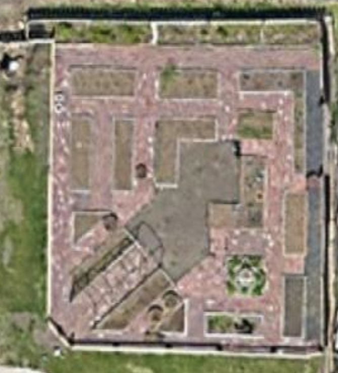
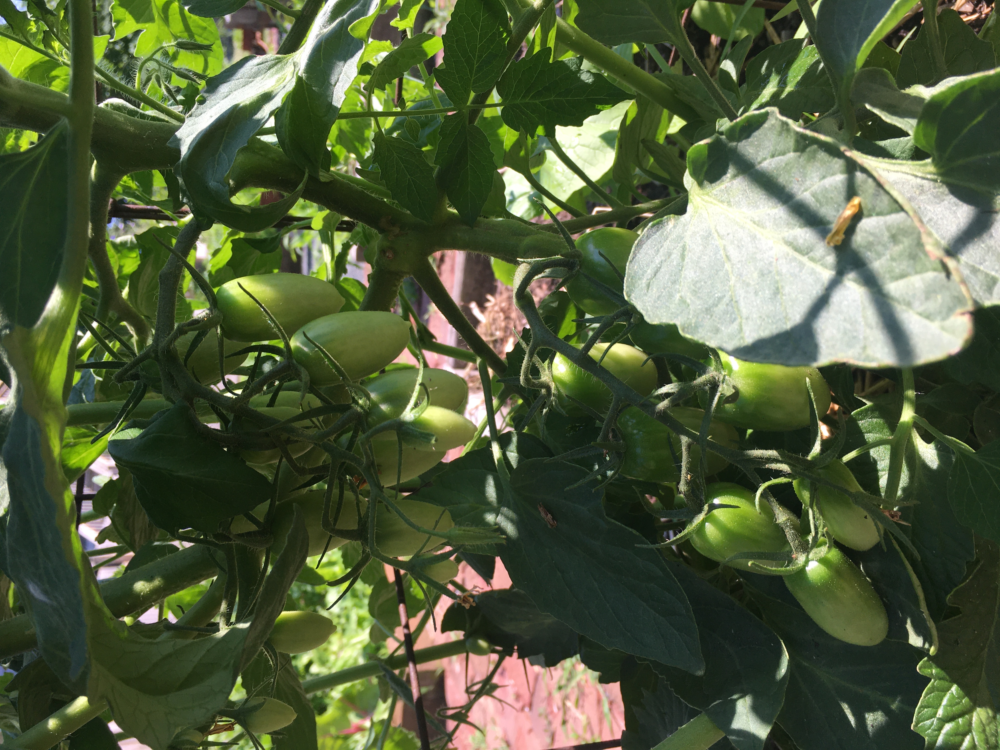
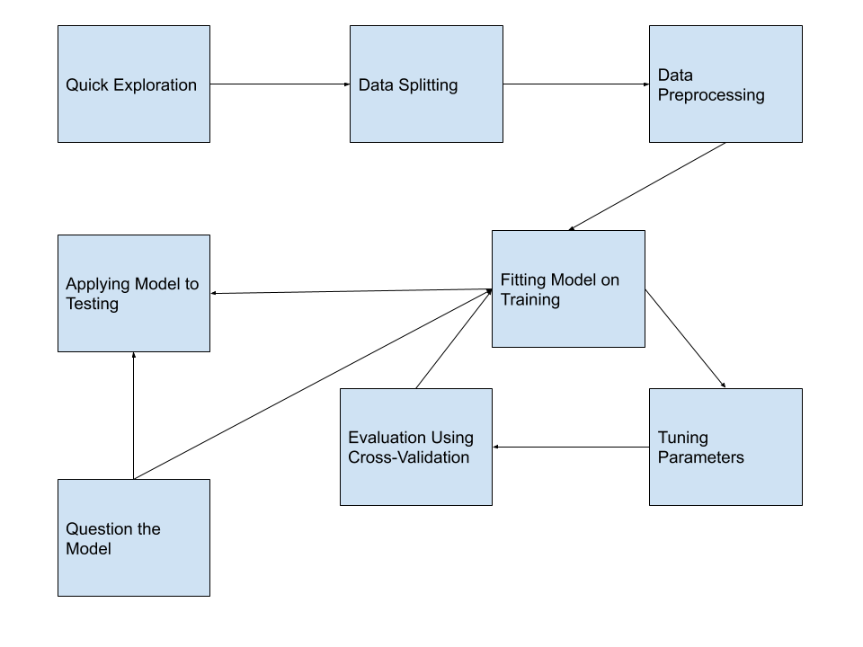
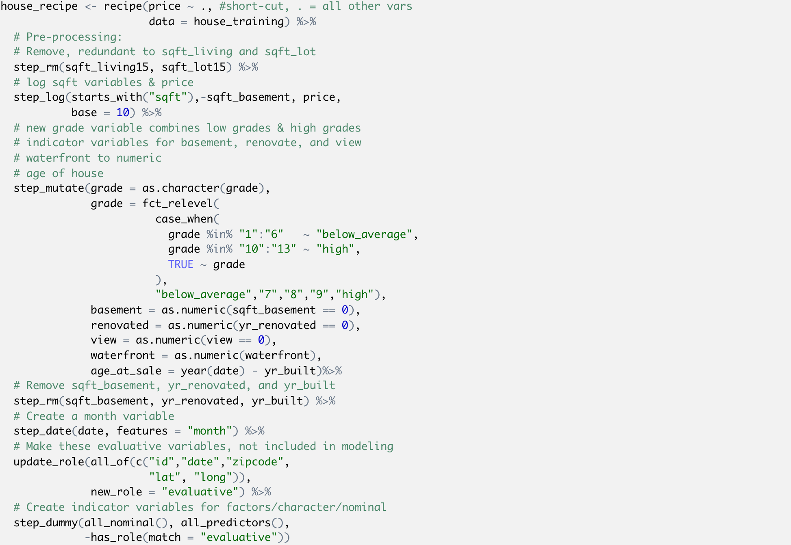
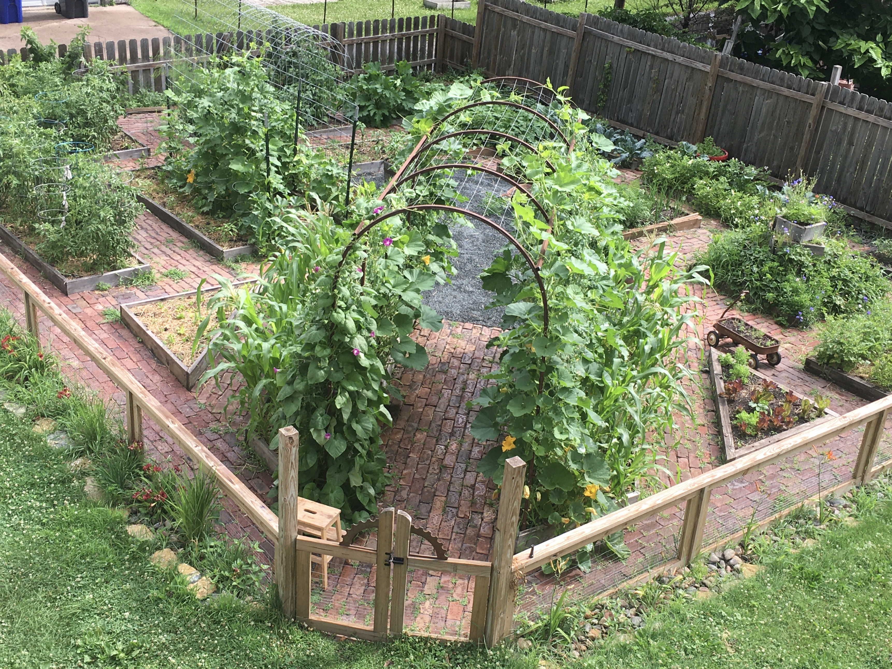

```{r setup, include=FALSE}
knitr::opts_chunk$set(echo = TRUE, warning = FALSE, message = FALSE)
```

## Who is this for?

<div class="columns-2">

{width=400}

Most helpful if you:

* Use a variety of modeling methods: linear models, generalized linear models, LASSO, trees, random forest, etc.  
* Are familiar with cross-validation.  
* Use the `carat` package.
* Are comfortable with the `tidyverse`.

Also useful if you:

* Have used some modeling techniques, like `lm()`.  
* Are excited about learning machine learning.  

Follow along at [https://github.com/llendway/2020_north_tidymodels](https://github.com/llendway/2020_north_tidymodels), using the tidymodels_demo.Rmd file.

</div>

<div class="notes">
Thank you and welcome. 

I am excited to give this talk today. I initially signed up to do it to force myself to learn `tidymodels`. If you have done extensive modeling and love using the `tidyverse`, then this should be exciting. I recommend following along in the tidymodels_demo.Rmd file. I will put the link to the GitHub repo in the chat now: https://github.com/llendway/2020_north_tidymodels. You can download the Rmd file or clone the repo.
</div>

## What will we cover?

<div class="centered">

{width=400}
</div>

<div class="notes">
In this talk, I will give a high-level overview of some `tidymodels` functions, like a birds' eye view. 
</div>

## What will we cover?

<div class="centered">

{width=350}

</div>

<div class="notes">
We will get to see some detail for a couple different types of models, even though I can't cover all `tidymodels` has to offer. I hope it will excite you enough to continue learning about it on your own. 
</div>

## What will we cover?

<div class="centered">

{width=600}
</div>

<div class="notes">
We will walk through all of these machine learning steps, using different `tidymodels` functions along the way. We start by using graphs to explore the data. We then split the data into different subsets. We pre-process that data, meaning we execute transformations of variables and other such things. Then we fit the the model (which may involve tuning parameters) and evaluate it. Throughout the process, we question the model and think about consequences of using the model on new sets of data.
</div>

## Libraries 

The libraries we will use:
```{r libraries}
library(tidyverse)         # for reading in data, graphing, and cleaning
library(lubridate)         # for date manipulation
library(tidymodels)        # for modeling
library(moderndive)        # for King County housing data
library(vip)               # for variable importance plots
theme_set(theme_minimal()) # my favorite ggplot2 theme :)
```

Similar to `tidyverse`, `tidymodels` is a collection of packages:
```{r}
tidymodels_packages()
```


<div class="notes">
First, here's all the libraries we will use. If you're following along in the Rmd file for you, they will be listed in the first code chunk.
</div>

## The data

According to the `house_prices` documentation, "This dataset contains house sale prices for King County, which includes Seattle. It includes homes sold between May 2014 and May 2015."

```{r data}
data("house_prices")

house_prices %>% 
  slice(1:10)
```

We will model the home price using the other variables in the model.

<div class="notes">
We will use the `house_prices` dataset from the `moderndive` library. The data were originally from Kaggle. This dataset contains house sale prices for King County, which includes Seattle. It includes homes sold between May 2014 and May 2015. 
</div>

## Exploration

```{r expl_quant, fig.width=8, fig.height=5, echo=FALSE}
house_prices %>% 
  select_if(is.numeric) %>% 
  pivot_longer(cols = everything(),names_to = "variable", values_to = "value") %>% 
  ggplot(aes(x = value)) +
  geom_histogram(bins = 30) +
  facet_wrap(vars(variable), scales = "free")
```

<div class="notes">
We start by exploring the data, first looking at the quantitative variables. 

Some observations include:

* Right-skewness in `price` and all variables regarding square footage --> log transform since we will be using linear regression.  
* Many 0's in `sqft_basement`, `view`, and `yr_renovated` --> create indicator variables of having that feature vs. not, ie. a variable called `basement` where a 0 indicates no basement (`sqft_basement` = 0) and a ` indicates a basement (`sqft_basement` > 0).  
* Age of home may be a better, more interpretable variable than year built --> `age_at_sale = year(date) - yr_built`.
</div>

## Exploration

```{r expl_cat, echo=FALSE}
house_prices %>% 
  select_if(is.factor) %>% 
  pivot_longer(cols = everything(),names_to = "variable", values_to = "value") %>% 
  ggplot(aes(x = value)) +
  geom_bar() +
  facet_wrap(vars(variable), scales = "free", nrow = 2)
```

<div class="notes">
Next, we examine the categorical variables.

* `condition` and `grade` both have levels with low counts --> make fewer categories.  
* `zipcode` has many unique levels --> don't use that variable.

The only other variables are `id` (not used in modeling), `date`, and `waterfront`. We might consider using the month the house was sold as a variable.
</div>

## Overview of modeling process

<div class="centered">

{width=900}
</div>

<div class="notes">
This shows a visualization of the modeling process.  

* Start by dividing data into training and testing. We use the training data to fit different types of models and to tune parameters of those models, if needed. The testing dataset is saved for the very end to compare a small subset of models. 
* The training set is further sampled into smaller datasets. I'll discuss more about that later.
</div>

## Data splitting

```{r init_split}
set.seed(327) #for reproducibility

# Randomly assigns 75% of the data to training.
house_split <- initial_split(house_prices, 
                             prop = .75)
house_split
#<training/testing/total>

house_training <- training(house_split)
house_testing <- testing(house_split)
```

<div class="notes">
The `initial_split()` function from the `rsample` library (part of `tidymodels`) is used to create this split. We do random sampling with this dataset, but there are other arguments that allow you to do things like stratified sampling. Then we use `training()` and `testing()` to extract the two datasets, `house_training` and `house_testing`. 
</div>

## Data splitting

Later, we will use 5-fold cross-validation to evaluate the model and tune model parameters. 

```{r cv}
set.seed(1211) # for reproducibility
house_cv <- vfold_cv(house_training, v = 5)
house_cv 
```

<div class="notes">
We set up the five folds of the training data using the `vfold_cv()` function. I will explain this in more detail later.
</div>

## Data preprocessing and recipe

```{r recipe_full, echo=FALSE}
house_recipe <- recipe(price ~ ., #short-cut, . = all other vars
                       data = house_training) %>% 
  # Pre-processing:
  # Remove, redundant to sqft_living and sqft_lot
  step_rm(sqft_living15, sqft_lot15) %>%
  # log sqft variables & price
  step_log(starts_with("sqft"),-sqft_basement, price, 
           base = 10) %>% 
  # new grade variable combines low grades & high grades
  # indicator variables for basement, renovate, and view 
  # waterfront to numeric
  # age of house
  step_mutate(grade = as.character(grade),
              grade = fct_relevel(
                        case_when(
                          grade %in% "1":"6"   ~ "below_average",
                          grade %in% "10":"13" ~ "high",
                          TRUE ~ grade
                        ),
                        "below_average","7","8","9","high"),
              basement = as.numeric(sqft_basement == 0),
              renovated = as.numeric(yr_renovated == 0),
              view = as.numeric(view == 0),
              waterfront = as.numeric(waterfront),
              age_at_sale = year(date) - yr_built)%>% 
  # Remove sqft_basement, yr_renovated, and yr_built
  step_rm(sqft_basement, yr_renovated, yr_built) %>% 
  # Create a month variable
  step_date(date, features = "month") %>% 
  # Make these evaluative variables, not included in modeling
  update_role(all_of(c("id","date","zipcode", 
                       "lat", "long")),
              new_role = "evaluative") %>% 
  # Create indicator variables for factors/character/nominal
  step_dummy(all_nominal(), all_predictors(), 
             -has_role(match = "evaluative"))
```

A variety of `step_xxx()` functions can be used to do data pre-processing/transforming. Find them all [here](https://www.tidymodels.org/find/recipes/).

{width=600}

<div class="notes">
After the data are split, we use the `recipe()` function to define the response or outcome variable and the predictor variables and variety of `step_xxx()` functions to pre-process/transform variables. This shows an image of the entire set of `recipe` and `step`s code in order to fit on one screen. I will break this up in the next couple slides. Note that these functions have not yet been applied to any dataset. We are setting it up to do that.
</div>


## Data preprocessing and recipe

Beginning of the code:

```{r recipe1, eval=FALSE}
house_recipe <- recipe(price ~ ., #short-cut, . = all other vars
                       data = house_training) %>% 
  # Pre-processing:
  # Remove, redundant to sqft_living and sqft_lot
  step_rm(sqft_living15, sqft_lot15) %>%
  # log sqft variables & price
  step_log(starts_with("sqft"),-sqft_basement, price, 
           base = 10) %>% 
```

<div class="notes">
* Like I just mentioned, the `recipe()` function defines the response or outcome variable and the predictor variables. Like in the `lm()` function, the variable to the left of the tilde is the response variable. Everything to the right is a predictor. Here I use the dot to mean all other variables. 

* `step_rm()` removes the variables listed

* `step_log()` takes the log (in this case, base 10) of the variables. I've also used some helper functions to help me choose those variables.
</div>

## Data preprocessing and recipe

Continuation of the code:

```{r recipe2, eval=FALSE}
  # new grade variable combines low grades & high grades
  # indicator variables for basement, renovate, and view 
  # waterfront to numeric
  # age of house
  step_mutate(grade = as.character(grade),
              grade = fct_relevel(
                        case_when(
                          grade %in% "1":"6"   ~ "below_average",
                          grade %in% "10":"13" ~ "high",
                          TRUE ~ grade
                        ),
                        "below_average","7","8","9","high"),
              basement = as.numeric(sqft_basement == 0),
              renovated = as.numeric(yr_renovated == 0),
              view = as.numeric(view == 0),
              waterfront = as.numeric(waterfront),
              age_at_sale = year(date) - yr_built)%>% 
```

<div class="notes">
* `step_mutate()` allows me to create my own variables in pretty much any way I could imagine.
</div>

## Data preprocessing and recipe

Continuation of the code:

```{r recipe3, eval=FALSE}
  # Remove sqft_basement, yr_renovated, and yr_built
  step_rm(sqft_basement, yr_renovated, yr_built) %>% 
  # Create a month variable
  step_date(date, features = "month") %>% 
  # Make these evaluative variables, not included in modeling
  update_role(all_of(c("id","date","zipcode", 
                       "lat", "long")),
              new_role = "evaluative") %>% 
  # Create indicator variables for factors/character/nominal
  step_dummy(all_nominal(), all_predictors(), 
             -has_role(match = "evaluative"))
```


<div class="notes">
* `step_date()` creates a month variable.

* `step_dummy()` creates indicator or dummy variables for categorical variables.

* We also use `update_roles()` to change the roles of some variables. In this case, I do not want to use these variables as predictors but may want to use them in model evaluation.
</div>

## Apply `recipe` and `step`s

Apply recipe and steps to training dataset, in order to see the output. Notice the names of the variables.

```{r apply_recipe}
house_recipe %>% 
  prep(house_training) %>%
  juice() 
```

<div class="notes">
Even though it's not necessary, I like applying the `recipe()` and `step()`s to the training data to check that all went as planned. Notice the variable `sqft_living` is now actually log base 10 of `sqft_living` and if we scroll to the right we can see examples of the indicator/dummy variables that were created.
</div>

## Defining the model

In order to define our model, we need to do these steps:

* Define the model type, which is the general type of model you want to fit.    
* Set the engine, which defines the package/function that will be used to fit the model.  
* Set the mode, which is either "regression" for continuous response variables or "classification" for binary/categorical response variables. (Note that for linear regression, it can only be "regression", so we don't NEED this step in this case.)  
* (OPTIONAL) Set arguments to tune. We'll see an example of this later.

Find all available functions from `parsnip` [here](https://www.tidymodels.org/find/parsnip/). [Here](https://parsnip.tidymodels.org/reference/linear_reg.html) is the detail for linear regression.

```{r linear_mod}
house_linear_mod <- 
  # Define a linear regression model
  linear_reg() %>% 
  # Set the engine to "lm" (lm() function is used to fit model)
  set_engine("lm") %>% 
  # Not necessary here, but good to remember for other models
  set_mode("regression")
```

<div class="notes">
Now that we have split the data and defined outcome/predictor variables and the pre-processing steps, we are ready to model! First, we will model `price` (which is actually now *log(price)*) using simple linear regression.

In order to define our model, we need to do these steps:

* Define the model type, which is the general type of model you want to fit. In this case `linear_reg()`. I'll put the link to `parsnip` functions in the chat: [https://www.tidymodels.org/find/parsnip/](https://www.tidymodels.org/find/parsnip/).
* Set the engine with `set_engine()`, which defines the package/function that will be used to fit the model.  In this case "lm".  
* Set the mode with `set_mode()`, which is either "regression" for continuous response variables or "classification" for binary/categorical response variables. (Note that for linear regression, it can only be "regression", so we don't NEED this step in this case, but I have it here so you don't forget it for other models later.)  
* (OPTIONAL) Set arguments to tune. We'll see an example of this later.

This is merely setting up the process. We haven't fit the model to data yet, and there's still one more step before we do - creating a workflow!
</div>

## Creating a workflow

This combines the preprocessing and model definition steps.

```{r workflow}
house_lm_wf <- 
  # Set up the workflow
  workflow() %>% 
  # Add the recipe
  add_recipe(house_recipe) %>% 
  # Add the modeling
  add_model(house_linear_mod)
```

<div class="notes">
The last step before actually fitting the model is setting up a workflow, which combines the recipe and steps with the model. 
</div>

## Workflow output

```{r workflow_output}
house_lm_wf
```

<div class="notes">
The `workflow` output shows us the preprocessing steps and the modeling step.
</div>

## Modeling

Use the `fit()` function to fit the model to training data. Then display the results nicely.

```{r fit_lm}
house_lm_fit <- 
  # Tell it the workflow
  house_lm_wf %>% 
  # Fit the model to the training data
  fit(house_training)

# Display the results nicely
house_lm_fit %>% 
  pull_workflow_fit() %>% 
  tidy() %>% 
  mutate_if(is.numeric, ~round(.x,3))
```
<div class="notes">
Now we are finally ready to fit the model! After all that work, this part seems easy. We first use the `fit()` function to fit the model, telling it which data set we want to fit the model to. Then we use `pull_workflow_fit()` and `tidy()` functions to display the results nicely.
</div>

## Evaluating model (overview)

To evaluate the model, we will use cross-validation (CV), specifically 5-fold CV. 

<div class="centered">

{width=800}
</div>

<div class="notes">
We want to know how well the model will perform on data it hasn't seen before. We use $k$-fold cross-validation to do this.

In $k$-fold cross-validation, we divide the data randomly into $k$ approximately equal groups or *folds*. The schematic here shows 5-fold cross-validation. 

The model is fit on $k-1$ of the folds and the remaining fold is used to evaluate the model. Let's look at the first row in the schematic. Here the model is fit on the data that are in folds 2, 3, 4, and 5. The model is evaluated on the data in fold 1. 

RMSE is a common performance metric for models with a quantitative response. It is computed by taking the difference between the predicted and actual response for each observation, squaring it, and taking the square root of the average over all observations. 

So, again looking at the first row in the schematic, the model is fit to folds 2, 3, 4, and 5 and we would use that model to compute the RMSE for fold 1. In the second row, the model is fit to the data in folds 1, 3, 4, and 5 and that model is used to compute the RMSE for the data in the 2nd fold. 

After this is done for all 5 folds, we take the average RMSE, to obtain the overall performance. This overall error is sometimes called the CV error. Averaging the performance over $k$ folds gives a better estimate of the true error than using one hold-out set. It also allows us to estimate its variability.
</div>

## Evaluating model (code)

```{r fit_model_cv}
house_lm_fit_cv <-
  # Tell it the workflow
  house_lm_wf %>% 
  # Fit the model (using the workflow) to the cv data
  fit_resamples(house_cv)

# rmse for each fold:
house_lm_fit_cv %>% 
  select(id, .metrics) %>% 
  unnest(.metrics) %>% 
  filter(.metric == "rmse")
```

<div class="notes">
This might seem like a lot of work, but thankfully this is easy to implement with the `fit_resamples()` function. The column called `.estimate` in the output shows the rmse for each fold. They are similar but not all the same. 
</div>

## Evaluating model (code)

```{r eval_model}
# Evaluation metrics averaged over all folds:
collect_metrics(house_lm_fit_cv)

# To show you where the averages come from:
house_lm_fit_cv %>% 
  select(id, .metrics) %>% 
  unnest(.metrics) %>% 
  group_by(.metric, .estimator) %>% 
  summarize(mean = mean(.estimate),
            n = n(),
            std_err = sd(.estimate)/sqrt(n))
```

<div class="notes">
The `collect_metrics()` function averages the metrics over all the evaluation folds. I also provided the code to show you how you could do that "by hand" so that you know where it comes from.
</div>

## Predicting and evaluating testing data

```{r fit_test}
house_lm_test <- 
  # The modeling work flow
  house_lm_wf %>% 
  # Use training data to fit the model and apply it to testing data
  last_fit(house_split)
# performance metrics from testing data
collect_metrics(house_lm_test)
# sample of predictions from testing data
collect_predictions(house_lm_test) %>% 
  slice(1:5)
```
<div class="notes">
In this simple scenario, we may be interested in seeing how the model performs on the testing data that was left out. The `last_fit()` function will fit the model to the training data and apply it to the testing data. Because it is using the workflow, it is applying the same transformation steps to the testing data as were applied to the training data.

After the model is fit and applied, we collect the performance metrics and display them and show a sample of predictions from the testing data.
</div>

## How will the model be used?

```{r price_pred_plot, echo=FALSE, fig.width=7, fig.height=5, fig.align='center'}
collect_predictions(house_lm_test) %>% 
  ggplot(aes(x = 10^price, y = 10^.pred)) +
  geom_point() +
  geom_smooth(se = FALSE) +
  geom_abline(slope = 1, intercept = 0, color = "darkred") +
  labs(x = "Actual price", y = "Predicted price") +
  scale_y_continuous(labels = scales::dollar_format(scale = .001, suffix = "K")) +
  scale_x_continuous(labels = scales::dollar_format(scale = .001, suffix = "K")) +
  coord_cartesian(xlim = c(0,1000000), ylim = c(0,1000000))

```

<div class="notes">

This shows predicted vs. actual prices for a zoomed-in subset of the data. 

When we create models, it is important to think about how the model will be used and specifically how the model could do harm. One thing to notice in the graphs above is that the lower priced homes are, on average, overestimated whereas higher priced homes are, on average, underestimated. 

What if this model was used to determine the price of homes for property tax purposes? Then lower priced homes would be overtaxed while higher priced homes would be under taxed. We would want to further improve this model before using it in that way.
</div>

## LASSO model - set up model

For some information about the model: https://en.wikipedia.org/wiki/Lasso_(statistics)

The `tune()` function inside of `set_args()` tells it that we will tune the `penalty` parameter later.

```{r lasso_mod}
house_lasso_mod <- 
  # Define a lasso model 
  # I believe default is mixture = 1 so probably don't need 
  linear_reg(mixture = 1) %>% 
  # Set the engine to "glmnet" 
  set_engine("glmnet") %>% 
  # The parameters we will tune.
  set_args(penalty = tune()) %>% 
  # Use "regression"
  set_mode("regression")
```

<div class="notes">
Next we move on to a slightly more complex model: [Least Absolute Shrinkage and Selection Operator (LASSO)](https://en.wikipedia.org/wiki/Lasso_(statistics)) regression, or LASSO for short. This method shrinks some coefficients to 0 based on a penalty term. We will use cross-validation to help us find the best penalty term. 

We will set up the model similar to how we set up the linear model, but now add the `set_args()` function I briefly mentioned earlier. We are telling it that we are going to tune the penalty parameter later.
</div>

## Create the workflow

We use the same recipe as before but use new model.

```{r lasso_workflow}
house_lasso_wf <- 
  # Set up the workflow
  workflow() %>% 
  # Add the recipe
  add_recipe(house_recipe) %>% 
  # Add the modeling
  add_model(house_lasso_mod)
```

<div class="notes">
Again, we create a workflow that uses the same recipe as before but updates the model to the LASSO model.
</div>

## Workflow output

```{r}
house_lasso_wf
```

<div class="notes">
The output confirms we are using a different model now.
</div>

## Tuning the penalty parameter

We use the `grid_regular()` function from the `dials` library to choose some values of the `penalty` parameter for us. Alternatively, we could give it a vector of values we want to try.

```{r tune_grid}
penalty_grid <- grid_regular(penalty(),
                             levels = 20)
penalty_grid
```

<div class="notes">
We use the `grid_regular()` function from the `dials` library (part of `tidymodels`) to choose some values of the `penalty` parameter for us. Alternatively, we could give it a vector of values we want to try.
</div>

## Tuning the penalty parameter

Use the `tune_grid()` function to fit the model using cross-validation for all `penalty_grid` values and evaluate on all the folds.

```{r tune}
house_lasso_tune <- 
  house_lasso_wf %>% 
  tune_grid(
    resamples = house_cv,
    grid = penalty_grid
    )

house_lasso_tune
```

<div class="notes">
Then, we use the `tune_grid()` function to fit the model using cross-validation for all `penalty_grid` values and evaluate on all the folds.
</div>

## Tuning the penalty parameter

Then look at the cross-validated results. This shows rmse for fold 1 for each `penalty` value from `penalty_grid`.

```{r tune_fold1}
# The rmse for each penalty value for fold 1:
house_lasso_tune %>% 
  select(id, .metrics) %>% 
  unnest(.metrics) %>% 
  filter(.metric == "rmse", id == "Fold1")
```

<div class="notes">
Next, look at the cross-validated results. This shows RMSE for fold 1 for each `penalty` value from `penalty_grid`. The model is fit to data from folds 2-5, then applied to fold 1 and RMSE is computed.
</div>

## Tuning the penalty parameter

```{r tune_results}
# rmse averaged over all folds for 5:
house_lasso_tune %>% 
  collect_metrics() %>% 
  filter(.metric == "rmse") %>% 
  slice(10:14)
# Best tuning parameter by smallest rmse
best_param <- house_lasso_tune %>% 
  select_best(metric = "rmse")
best_param
```

<div class="notes">
`collect_metrics()` averages RMSE for each `penalty` term over all folds.

We choose the best penalty parameter as the one with the smallest cross-validated RMSE. The `select_best()` does this. There are other ways you can select parameters, like `select_by_one_std_error()` which "selects the most simple model that is within one standard error of the numerically optimal results".
</div>

## Tuning the penalty parameter

```{r rmse_viz, fig.width=4, fig.height=2.5}
# Visualize rmse vs. penalty
house_lasso_tune %>% 
  collect_metrics() %>% 
  filter(.metric == "rmse") %>% 
  ggplot(aes(x = penalty, y = mean)) +
  geom_point() +
  geom_line() +
  scale_x_log10() +
  labs(x = "penalty", y = "rmse")
```


<div class="notes">
This visually shows the cross-validated RMSE for each penalty term. It is hard to see, but smallest RMSE is 0.1354254, which occurs at a penalty of about 2.07 x 10^-04
</div>

## Finalize workflow for best tuned parameter

```{r tune_wf}
house_lasso_final_wf <- house_lasso_wf %>% 
  finalize_workflow(best_param)
house_lasso_final_wf
```

<div class="notes">
Once we choose the parameter we want, we adjust the workflow to include the best tuning parameter using the `finalize_workflow()` function.
</div>

## Evaluate on testing data

Like before, we apply the model to the test data and examine some final metrics. We also show the metrics from the regular linear model. 

```{r lasso_test}
# Fit model with best tuning parameter(s) to training data and apply to test data
house_lasso_test <- house_lasso_final_wf %>% 
  last_fit(house_split)

# Metrics for model applied to test data
house_lasso_test %>% 
  collect_metrics()

# Compare to regular linear regression results
collect_metrics(house_lm_test)
```

<div class="notes">
Like before, we apply the model to the test data and examine some final metrics. We also show the metrics from the regular linear model. It looks like performance for the LASSO model is ever so slightly better, but just barely.
</div>

## Thank you & Resources

<div class="columns-2">

{width=500}

* [Rebecca Barter's blog](http://www.rebeccabarter.com/blog/2020-03-25_machine_learning/)

* [tidymodels website](https://www.tidymodels.org/start/) (Alison Hill, Max Kuhn, Desirée De Leon, Julia Silge)

* [Julia Silge's tidymodels example](https://juliasilge.com/blog/lasso-the-office/)

</div>

<div class="notes">
So that was my very quick overview of `tidymodels`. I hope it got you excited to use it. 

Thank you to all of these folks for the wonderful resources and for developing these packages! Check out their pages for more examples and resources.
</div>

## THANK YOU!

You have *bean* a wonderful audience!

<div class="centered">

{width=300}

</div>

## THANK YOU!

May your `tidymodels` endeavors be fruit ... er ... vegetable-ful?

<div class="centered">

{width=600}

</div>


## Questions?

GitHub repo: [https://github.com/llendway/2020_north_tidymodels](https://github.com/llendway/2020_north_tidymodels)

Veggie photos: [https://www.pinterest.com/lisalendway/jungle-garden-20/](https://www.pinterest.com/lisalendway/jungle-garden-20/)

Veggie data and repo: [https://github.com/llendway/jungle_garden_2020](https://github.com/llendway/jungle_garden_2020)


