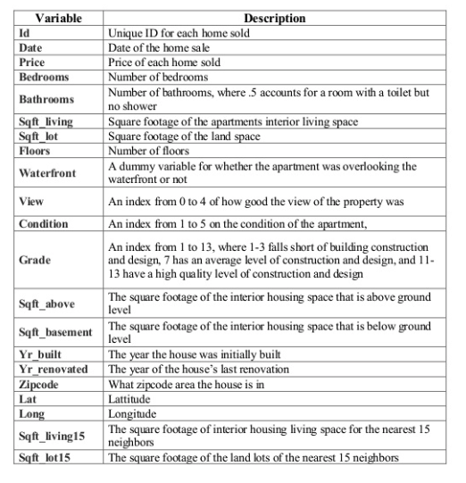

```{r setup, include=FALSE}
knitr::opts_chunk$set(echo = TRUE, warning = FALSE, message = FALSE)
```

Load `tidyverse`, `tidymodels`, and a few other libraries and set the theme (optional).

```{r libraries}
library(tidyverse)         # for reading in data, graphing, and cleaning
library(tidymodels)        # for modeling
library(lubridate)         # for date manipulation
library(moderndive)        # for King County housing data
library(vip)               # for variable importance plots
theme_set(theme_minimal()) # my favorite ggplot2 theme :)
```

Read in the King County Housing data and take a look at the first 5 rows.

```{r data}
data("house_prices")

house_prices %>% 
  slice(1:5)
```


According to the `house_prices` documentation, "This dataset contains house sale prices for King County, which includes Seattle. It includes homes sold between May 2014 and May 2015. This dataset was obtained from [Kaggle.com](https://www.kaggle.com/harlfoxem/housesalesprediction/data)." The description of the variables in the dataset in the documentation seem to be a little off. A more accurate description is provided in the image below. We will model the price of homes. 

{width=400px}

# Exploration

Take a quick look at distributions of all the variables to check for anything irregular.

Quantitative variables:

```{r expl_quant, fig.width=6, fig.height=4}
house_prices %>% 
  select_if(is.numeric) %>% 
  pivot_longer(cols = everything(),names_to = "variable", values_to = "value") %>% 
  ggplot(aes(x = value)) +
  geom_histogram(bins = 30) +
  facet_wrap(vars(variable), scales = "free")
```

Things I noticed and pre-processing thoughts:
* Right-skewness in `price` and all variables regarding square footage --> log transform if using linear regression.
* Many 0's in `sqft_basement`, `view`, and `yr_renovated` --> create indicator variables of having that feature vs. not, ie. a variable called `basement` where a 0 indicates no basement (`sqft_basement` = 0) and a ` indicates a basement (`sqft_basement` > 0).  
* Age of home may be a better, more interpretable variable than year built --> `age_at_sale = year(date) - yr_built`.

```{r expl_cat}
house_prices %>% 
  select_if(is.factor) %>% 
  pivot_longer(cols = everything(),names_to = "variable", values_to = "value") %>% 
  ggplot(aes(x = value)) +
  geom_bar() +
  facet_wrap(vars(variable), scales = "free", nrow = 2)
```

Things I noticed and pre-processing thoughts:
* `condition` and `grade` both have levels with low counts --> make fewer categories.  
* `zipcode` has many unique levels --> don't use that variable.

The only other variables are `id` (not used in modeling), `date`, and `waterfront`. We might consider using the month the house was sold as a variable.


# Data splitting

First, we split the data into  training and testing datasets.  We use the training data to fit different types of models and to tune parameters of those models, if needed. The testing dataset is saved for the very end to compare a small subset of models. The `initial_split()` function from the `rsample` library (part of `tidymodels`) is used to create this split. We just do random splitting with this dataset, but there are other arguments that allow you to do stratified sampling. Then we use `training()` and `testing()` to extract the two datasets, `house_training` and `house_testing`. 

```{r init_split}
set.seed(327) #for reproducibility

# Randomly assigns 75% of the data to training.
house_split <- initial_split(house_prices, 
                             prop = .75)
house_split
#<training/testing/total>

house_training <- training(house_split)
house_testing <- testing(house_split)
```

Later, we will use 5-fold cross-validation to evaluate the model and tune model parameters. We set up the five folds of the training data using the `vfold_cv()` function. We will explain this in more detail later.

```{r cv}
set.seed(1211) # for reproducibility
house_cv <- vfold_cv(house_training, v = 5)
```


# Data preprocessing: `recipe()`s and `step_xxx()`s

* We use the `recipe()` function to define the response/outcome variable and the predictor variables. 

* A variety of `step_xxx()` functions can be used to do any data pre-processing/transforming. Find them all [here](https://www.tidymodels.org/find/recipes/). I used a few, with brief descriptions in the code. I also used some selector functions, like `all_predictors()` and `all_nominal()` to help me select the right variables.

* We also use `update_roles()` to change the roles of some variables. For us, these are variables we may want to include for evaluation purposes but will not be used in building the model. I chose the role of `evaluative` but you could name that role anything you want, eg. `id`, `extra`, `junk` (maybe a bad idea?).

```{r recipe}
house_recipe <- recipe(price ~ ., #short-cut, . = all other vars
                       data = house_training) %>% 
  # Pre-processing:
  # Remove, redundant to sqft_living and sqft_lot
  step_rm(sqft_living15, sqft_lot15) %>%
  # log sqft variables & price
  step_log(starts_with("sqft"),-sqft_basement, price, 
           base = 10) %>% 
  # new grade variable combines low grades & high grades
  # indicator variables for basement, renovate, and view 
  # waterfront to numeric
  # age of house
  step_mutate(grade = as.character(grade),
              grade = fct_relevel(
                        case_when(
                          grade %in% "1":"6"   ~ "below_average",
                          grade %in% "10":"13" ~ "high",
                          TRUE ~ grade
                        ),
                        "below_average","7","8","9","high"),
              basement = as.numeric(sqft_basement == 0),
              renovated = as.numeric(yr_renovated == 0),
              view = as.numeric(view == 0),
              waterfront = as.numeric(waterfront),
              age_at_sale = year(date) - yr_built)%>% 
  # Remove sqft_basement, yr_renovated, and yr_built
  step_rm(sqft_basement, yr_renovated, yr_built) %>% 
  # Create a month variable
  step_date(date, features = "month") %>% 
  # Make these evaluative variables, not included in modeling
  update_role(all_of(c("id","date","zipcode", 
                       "lat", "long")),
              new_role = "evaluative") %>% 
  # Create indicator variables for factors/character/nominal
  step_dummy(all_nominal(), all_predictors(), 
             -has_role(match = "evaluative"))
```

Apply to training dataset, just to see what happens. Notice the names of the variables.

```{r apply_recipe}
house_recipe %>% 
  prep(house_training) %>%
  juice() 
```

# Defining the model and creating workflows

Now that we have split and pre-processed the data, we are ready to model! First, we will model `price` (which is actually now *log(price)*) using simple linear regression.

We will do this using some modeling functions from the `parsnip` package. Find all available functions [here](https://www.tidymodels.org/find/parsnip/). [Here](https://parsnip.tidymodels.org/reference/linear_reg.html) is the detail for linear regression.

In order to define our model, we need to do these steps:

* Define the model type, which is the general type of model you want to fit.    
* Set the engine, which defines the package/function that will be used to fit the model.  
* Set the mode, which is either "regression" for continuous response variables or "classification" for binary/categorical response variables. (Note that for linear regression, it can only be "regression", so we don't NEED this step in this case.)  
* (OPTIONAL) Set arguments to tune. We'll see an example of this later.

```{r linear_mod}
house_linear_mod <- 
  # Define a linear regression model
  linear_reg() %>% 
  # Set the engine to "lm" (lm() function is used to fit model)
  set_engine("lm") %>% 
  # Not necessary here, but good to remember for other models
  set_mode("regression")
```

This is just setting up the process. We haven't fit the model to data yet, and there's still one more step before we do - creating a workflow! This combines the preprocessing and model definition steps.

```{r workflow}
house_lm_wf <- 
  # Set up the workflow
  workflow() %>% 
  # Add the recipe
  add_recipe(house_recipe) %>% 
  # Add the modeling
  add_model(house_linear_mod)

house_lm_wf
```

# Modeling and evaluating

Now we are finally ready to fit the model! After all that work, this part seems easy. We first use the `fit()` function to fit the model, telling it which data set we want to fit the model to. Then we use some other functions to display the results nicely.

```{r fit_lm}
house_lm_fit <- 
  # Tell it the workflow
  house_lm_wf %>% 
  # Fit the model to the training data
  fit(house_training)

# Display the results nicely
house_lm_fit %>% 
  pull_workflow_fit() %>% 
  tidy() %>% 
  mutate_if(is.numeric, ~round(.x,3))
```

To evaluate the model, we will use cross-validation (CV), specifically 5-fold CV. (I am guessing we don't have to do both the previous step of fitting a model on the training data AND this step, but I couldn't figure out how to extract the final model from the CV data ... so this was my solution for now.) So, we fit the model using the 5-fold dataset we created at the beginning. For a deeper discussion of cross-validation, I recommend Bradley Boehmke's *Resampling* section of [Hands on Machine Learning with R](https://bradleyboehmke.github.io/HOML/process.html#resampling).

```{r fit_model_cv}
set.seed(456) # For reproducibility - not needed for this algorithm

house_lm_fit_cv <-
  # Tell it the workflow
  house_lm_wf %>% 
  # Fit the model (using the workflow) to the cv data
  fit_resamples(house_cv)

# The evaluation metrics for each fold:
house_lm_fit_cv %>% 
  select(id, .metrics) %>% 
  unnest(.metrics)

# Evaluation metrics averaged over all folds:
collect_metrics(house_lm_fit_cv)

# Just to show you where the averages come from:
house_lm_fit_cv %>% 
  select(id, .metrics) %>% 
  unnest(.metrics) %>% 
  group_by(.metric, .estimator) %>% 
  summarize(mean = mean(.estimate),
            n = n(),
            std_err = sd(.estimate)/sqrt(n))
```

# Predicting and evaluating testing data

In this simple scenario, we may be interested in seeing how the model performs on the testing data that was left out. The code below will fit the model to the training data and apply it to the testing data. There are other ways we could have done this, but the way we do it here will be useful when we start using more complex models where we need to tune model parameters.

After the model is fit and applied, we collect the performance metrics and display them and show the predictions from the testing data.

```{r fit_test}
house_lm_test <- 
  # The modeling work flow
  house_lm_wf %>% 
  # Use training data to fit the model and apply it to testing data
  last_fit(house_split)

# performance metrics from testing data
collect_metrics(house_lm_test)

# predictions from testing data
collect_predictions(house_lm_test)
```

The code below creates a simple plot to examine predicted vs. actual price from the house data. 

```{r act_pred_plot}
collect_predictions(house_lm_test) %>% 
  ggplot(aes(x = price, y = .pred)) +
  geom_point() +
  geom_smooth(se = FALSE) +
  geom_abline(slope = 1, intercept = 0, color = "darkred") +
  labs(x = "Actual log(price)", y = "Predicted log(price)")
```

```{r price_pred_plot}
collect_predictions(house_lm_test) %>% 
  ggplot(aes(x = 10^price, y = 10^.pred)) +
  geom_point() +
  geom_smooth(se = FALSE) +
  geom_abline(slope = 1, intercept = 0, color = "darkred") +
  labs(x = "Actual price", y = "Predicted price")
```

# How will the model be used?

When we use create models, it is important to think about how the model will be used and specifically how the model could do harm. One thing to notice in the graphs above is that the price of lower priced homes are, on average, overestimated whereas the price of higher priced homes are, on average, underestimated. 

What if this model was used to determine the price of homes for property tax purposes? Then lower priced homes would be overtaxed while higher priced homes would be undertaxed. 

# More complex model with tuning parameters

Now we are going to try using [Least Absolute Shrinkage and Selection Operator (LASSO)](https://en.wikipedia.org/wiki/Lasso_(statistics)) regression. This method shrinks some coefficients to 0 based on a penalty term. We will use cross-validation to help us find the best penalty term. 

## Setting up the model

We will set up the model similar to how we set up the linear model, but add a `set_args()` function. We are telling it that we are going to tune the penalty parameter later.

```{r lasso_mod}
house_lasso_mod <- 
  # Define a lasso model 
  # I believe default is mixture = 1 so probably don't need 
  linear_reg(mixture = 1) %>% 
  # Set the engine to "glmnet" 
  set_engine("glmnet") %>% 
  # The parameters we will tune.
  set_args(penalty = tune()) %>% 
  # Use "regression"
  set_mode("regression")
```

## Updating workflow

And then we create a LASSO workflow.

```{r lasso_workflow}
house_lasso_wf <- 
  # Set up the workflow
  workflow() %>% 
  # Add the recipe
  add_recipe(house_recipe) %>% 
  # Add the modeling
  add_model(house_lasso_mod)

house_lasso_wf
```

## Tuning the penalty parameter

We use the `grid_regular()` function from the `dials` library to choose some values of the `penalty` parameter for us. Alternatively, we could give it a vector of values we want to try.

```{r tune_grid}
penalty_grid <- grid_regular(penalty(),
                             levels = 20)
penalty_grid
```

Use the `tune_grid()` function to fit the model using cross-validation for all `penalty_grid` values and evaluate on all the folds.

```{r tune}
house_lasso_tune <- 
  house_lasso_wf %>% 
  tune_grid(
    resamples = house_cv,
    grid = penalty_grid
    )

house_lasso_tune
```

Then look at the cross-validated results.

```{r tune_results}
# The rmse for each fold:
house_lasso_tune %>% 
  select(id, .metrics) %>% 
  unnest(.metrics) %>% 
  filter(.metric == "rmse")

# rmse averaged over all folds:
house_lasso_tune %>% 
  collect_metrics() %>% 
  filter(.metric == "rmse")

# Visualize rmse vs. penalty
house_lasso_tune %>% 
  collect_metrics() %>% 
  filter(.metric == "rmse") %>% 
  ggplot(aes(x = penalty, y = mean)) +
  geom_point() +
  geom_line() +
  scale_x_log10() +
  labs(x = "penalty", y = "rmse")

# Best tuning parameter by smallest rmse
best_param <- house_lasso_tune %>% 
  select_best(metric = "rmse")
best_param
```

## Update worflow for best tuned parameter

Adjust the workflow to include the best tuning parameter (smallest rmse, using `select_best()` in previous step) in the model. There are other ways you can select models, like `select_by_one_std_error()` which "selects the most simple model that is within one standard error of the numerically optimal results".

```{r tune_wf}
# Finalize workflow
house_lasso_final_wf <- house_lasso_wf %>% 
  finalize_workflow(best_param)
house_lasso_final_wf
```

## Fit best tune to training data

Now we could fit this to the training data and look at the resulting model. The model output wasn't what I was expecting. According to Julia Silge's response to my question [here](https://juliasilge.com/blog/lasso-the-office/), this should be fixed if you install parsnip from GitHub] using `devtools::install_github("tidymodels/parsnip")` from the `devtools` library.

```{r lasso_train}
house_lasso_final_mod <- house_lasso_final_wf %>% 
  fit(data = house_training)
house_lasso_final_mod

# This output is not what I expected. Still investigating.
house_lasso_final_mod %>% 
  pull_workflow_fit() %>% 
  tidy()
```

We can visualize variable importance.

```{r vip}
# Visualize variable importance
house_lasso_final_mod %>% 
  pull_workflow_fit() %>% 
  vip()
```

## Evaluate on testing data

Lastly, we apply the model to the test data and examine some final metrics. We also show the metrics from the regular linear model. It looks like performance for the LASSO model is ever so slightly better, but just barely.

```{r lasso_test}
# Fit model with best tuning parameter(s) to training data and apply to test data
house_lasso_test <- house_lasso_final_wf %>% 
  last_fit(house_split)

# Metrics for model applied to test data
house_lasso_test %>% 
  collect_metrics()

# Compare to regular linear regression results
collect_metrics(house_lm_test)
```

# Resources

Thanks to many other folks for sharing materials about `tidymodels`, including

{width=500}

These are some resources I used to help create this activity:

* [Rebecca Barter's blog](http://www.rebeccabarter.com/blog/2020-03-25_machine_learning/)

* [tidymodels website](https://www.tidymodels.org/start/) (Alison Hill, Max Kuhn, Desirée De Leon, Julia Silge)

* [Julia Silge's tidymodels example](https://juliasilge.com/blog/lasso-the-office/)


